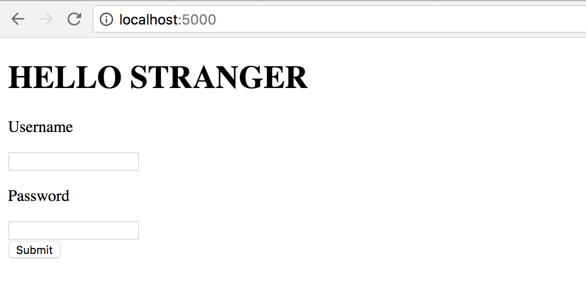

# Adding forms to your website

## What you should have
- `app.py` with a few routes
  - Uses `return render_template()` to generate and return an html file.
- `templates` directory with html files
- `templates/home.html` html file that uses Jinja
- 'my_venv' your virtual environment!

If you do not have all of these items with their specification, you can refer to the [jinja tutorial](../jinja/README.md) to get caught up!


### Table of Contents
1. [Basic-Form](#basic-form)
2. [Flask-Bootstrap](#flask-bootstrap)
3. [Forms](#wtforms)

## Basic Form

In lecture this week, we looked at how to use a basic form with Flask. Feel free to skip this section if you have already implemented your own form along with the lecture. Otherwise, we will be making a simple form to login a set of users.

1. We will add our form processing to the `'/'` (the home) route of our website. Add to this function a pre-defined dictionary of usernames and passwords which will contain our valid users. Your dictionary should looks something like
`users = {'name1': 'password1', 'name2': 'password2', ...}`
Note that in reality, you should NEVER save user passwords in plain text - they should always be encrypted!

2. Now switch over to the html file that is returned by your main route. (**Note:** This should be under your templates directory.) Add a [form tag](https://developer.mozilla.org/en-US/docs/Learn/HTML/Forms/Your_first_HTML_form) to your html page. Remember to set the `action` attribute to our homepage endpoint and the `method` attribute to `'post'`.  Next add two `<input>` tags (you can use the `type='password'` input) that will get the username and passwords of our users. As in lecture, give each of them a name – one should be `username` and the other `password`. Also, be sure to include a submit input tag! Your form should look something like the following

  ```html
  <form action='/' method='post'>
    <input type='text' name='username'>
    ...
    <input type='submit'>
  </form>
  ```

3. If you run your html page, you should see something similar to the following!


4. However, if you tried to submit the form now, you would get a method not accepted error. We need to edit our route so that it can accept the POST method. Change your `'/'` route to include a methods argument.
  ```python
  @app.route('/', methods=['GET', 'POST'])
  ...
  ```

5. Now check to see if the username and password submitted matches the pair in our dictionary. Here are some hints to get you started.
  - The form variables are in a python dictionary that you can access via `request.form`. Make sure to have `from flask import ..., request`
  - Be sure that you differentiate a POST request from a GET request to your endpoint by checking the variable `request.method`.
  - If there is a match, pass the username into your `render_template()` function and display the name on the page.

6. Test to make sure that you can submit your form!!

Often, when writing HTML we want to be able to generate rich, well designed pages without having to write hundreds of lines of our own CSS. Luckily, there are many libraries out there that provide a predefined set of constructs that make websites more responsive and look nicer! We'll be showing how to include the bootstrap library directly into our flask application.

**NOTE:** This step is optional. If you would just skip this setup, please go download a website template [here](https://github.com/ADI-Academy/AcademySimpleWebsite).

1. Download [flask-bootstrap](https://pythonhosted.org/Flask-Bootstrap/) by using the following command in your terminal. *Make sure that your virtual environment is activated!!*
  ```
  $ pip install flask-bootstrap
  ```

2. First off, we need to initialize flask-bootstrap in our app by editing our ```app.py```. First import `flask_bootstrap`:
  ```python
  from flask import Flask, ...
  from flask_bootstrap import Bootstrap

  ```
3. We then need to initialize `flask-boostrap` for our current app by adding the last two lines:
  ```python
  app = Flask(__name__)
  ...
  bootstrap = Bootstrap()
  bootstrap.init_app(app)
  ```

4. We now have Bootstrap functionality! In order to see the results, we will need to edit our ```base.html``` template file (in the templates folder). Add the following line to the top of the file:
  ```html
  
  ```
  This will automatically include all the necessary tags for your html file (including the ```<html>...</html>``` tags). Delete the opening and closing html tags now.

5. We will also replace the ```<head>...</head>``` portion with the specially generated bootstrap templating code.
    ```html
    
    {{ super() }}
    <!-- CUSTOM LINKS TO CSS AND JAVASCRIPT GO HERE -->
    
    ```
6. We can also add a special block tag around our navigation bar.
  ```html
  
    <div class="navbar navbar-inverse" role="navigation">
      ...
    </div>
  
  ```
  Refer to the example code included in this folder to make sure that your ```base.html``` file matches.

7. If you run your web app now, you should be able to see the exact same results as before! It looks like nothing has changed, but we've just abstracted away a lot of the manual import of bootstrap files and we'll see later in this lesson the other uses that this gives us.


## WTForms
Forms, while useful and versatile, are still rather clunky to use. We do not yet have a reasonable way of validating form fields or a quick and efficient way of making them. In this section, we explore one of the most widely-used form libraries available to python and the recommended way of writing forms in flask.

1. Download WTForms by using the following command. *Again, make sure that you are in your virtual environment*
  ```
  $ pip install flask-wtf
  ```
  This command should install both ```flask-wtf``` and ```WTForms```.

2. Let's create our first form! We'll create a simple login form that asks for the username, password, email and name. (Feel free to add other functionality as well) Create a new file and name it ```form.py```. Make sure that it exists in the same directory as your app.py. We do this to separate our code and make one part independent from other parts.

3. Import the necessary form requirements - we'll go over what these each mean as we build our custom form.
  ```python
  from flask_wtf import FlaskForm
  from wtforms import StringField, PasswordField, SubmitField
  ```

4. We need to build a class (kudos to 1004!) that describes our form. This is a lot simpler than you might imagine.
  ```python
  class LoginForm(FlaskForm):
      email = StringField('Email')
      username = StringField('Username')
      password = PasswordField('Password')
      submit = SubmitField('Register')
  ```

5. Now that we have our form, we need to have a way to process it. Since all of our logic and processing will be done in ```app.py``` we need some way to link the form with the app. We can do this by importing our ```LoginForm``` from ```form.py```. Add the following line at the top of your ```app.py``` file.
  ```python
  from flask import Flask, ...
  from form import LoginForm
  ```

6. We've arrived at the complicated part. Now that we have our LoginForm object in our ```app.py```, how should we process it? There are many complicated things that you can do with forms (saving a user, making a transaction, etc.) but for now, we'll just print out the username back to the user to demonstrate how forms work. We'll be working with the ```login``` route in ```app.py``` that we defined in a previous lecture.
  ```python
  @app.route('/login')
  def login():
      username = None
      form = LoginForm()
      if form.validate_on_submit():
          username = form.username.data
          print username
      return render_template('login.html', form=form, name=username)
  ```

7. You will also need to set a secret key in order to enable [CSRF](https://en.wikipedia.org/wiki/Cross-site_request_forgery) protection. Add the following line to your ```app.py```:
  ```python
  app = Flask(__name__)
  ...
  app.config['SECRET_KEY'] = 'SOME_STRING_THATS_SECRET'
  ```
  Ideally, we would put the SECRET_KEY as an environment variable in our system, but we'll just keep it hardecoded in the app for now.

8. From our basic (and actually incomplete) form processing, we now want to be able to display our form to see. Luckily, there is an extremely easy way to do this using flask-bootstrap and flask-forms. Navigate to the ```base.html``` and insert the following line at the top:
  ```html
  
  ```
  This will give us functionality to use wtforms in html.

9. Now go to your ```login.html``` that is being rendered by the ```login``` route. We only need to add one line to display our new form!
  ```html
  
  ...
  
  <div class="col-md-4">
    {{ wtf.quick_form(form) }}
  </div>
  

  ```
  We will also add a little tag that will display the name variable if its defined.
  ```html
  
  
    <h1>Hello {{ name }}</h1>
  
  ...
  
  ```
10. If all goes well, then you should be able to see your generated form as if by magic!! However there's a problem - if you try to submit you'll run into errors.

11. First, you'll see a Method Not Allowed error. Our ```login``` route only accepts GET requests right now but our forms will be submitting data via a POST request. (We are asking for a password so we need security!). To fix this, change the definition of your login route.
  ```python
  @app.route('login', methods=['GET', 'POST'])
  def login():
      ...
  ```

12. Now if you try to submit, it should go through! If you check the terminal output, you can also see the username printed out so everything seems to be going fine. HOWEVER, you should also notice that the values that we input to our values didn't change. Furthermore, if you try to refresh the page, **you'll see that it resubmits the form!!!** This is vey dangerous behavior and it's because after we submit our POST request, the page doesn't know where to go afterwards so it stays on the POST request stage. We are going to implement a very often-used sequence known as a *Post/Redirect/Get Pattern*.

13. We're going to import the ```redirect``` function in flask.
  ```python
  from flask import ..., redirect
  ```

14. We can return a **redirect response** after our form processes so that it can GET the normal webpage again.
  ```python
  if form.validate_on_submit():
      ...
      return redirect(url_for('login'))

  ```
  This will redirect after your POST request to the login page again and you won't be getting a POST resubmission after refresh!


15. However, we have another problem! The username is no longer being rendered and we expect to be seeing a **Hello <username>**. This is because our username variable is forgotten right we redirect. Luckily, we have a way to save variables for user sessions!

16. We can import the session variable from python.
  ```python
  from flask import ..., session
  ```

17. Now we can save user variables using the session object!
  ```python
  if form.validate_on_submit():
      session['username'] = form.username.data
      session['name'] = form.name.data
      ...

  return render_template('login.html', form=form, name=session.get('name'))
  ```
18. If you run this you will probably get a bug! Obviously we don't want that bug but try to see if you can fix it. There are several ways to do so but to get the best understanding of what's going on see if you can figure out what's wrong with ```form.py```.

19. This way you should be able to save your user's information! (**Note:** We use the ```.get()``` method so that we return ```None``` if we can't find the name in the session object.) We now have the beginnings of a user management system!!!
